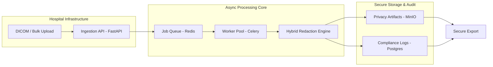

<div align="center">

</div>

# GuardVision: Privacy Intelligence for Everyone


[]()
[]()

**GuardVision** is a next-generation privacy protection system that automatically detects and redacts sensitive personal (PII) and medical (PHI) information from images.

We operate on a **Dual-Mode Architecture** designed to serve both individual users needing quick privacy tools and large healthcare enterprises requiring strict compliance.

---

## 🚀 Two Modes, One Mission

### 1. Individual Mode (Powered by Gemini Flash)
*For researchers, developers, and everyday users.*
- **Instant Privacy**: Drop an image, get a redacted version in seconds.
- **AI-Driven Accuracy**: Uses **Gemini 1.5 Flash** to visually recognize complex PII like faces, signatures, and credit cards without traditional OCR limitations.
- **Zero Setup**: Runs entirely in the browser/client-side with a lightweight API call.

### 2. Enterprise Mode (Hospital-Grade Architecture)
*For hospitals, insurance firms, and regulated industries.*
- **Bulk Processing Pipeline**: A robust backend architecture designed to handle thousands of patient records or DICOM files simultaneously.
- **Deterministic Compliance**: Combines AI with **Microsoft Presidio** and strict rule-based redaction to ensure 0% data leakage transparency.
- **Full Auditability**: Every single redaction is logged, time-stamped, and verifiable for HIPAA/GDPR audits.

---

## 🏗️ Enterprise Architecture

The Enterprise Mode is built on a scalable, asynchronous pipeline designed for high-throughput environments like PACS servers or data lakes.



### Technical Stack (Enterprise)
- **Ingestion**: **FastAPI** for high-performance, async request handling.
- **Queue**: **Redis** to decouple upload from processing, preventing system overloads.
- **Workers**: **Celery** distributed workers for parallel processing of massive datasets.
- **Storage**: **MinIO** (S3-compatible) for secure, on-premise object storage.
- **Database**: **PostgreSQL** for immutable audit trails of every redacted entity.

---

## 🎥 Demo (Individual Mode)

See the real-time AI redaction in action:

[](https://www.youtube.com/watch?v=-PxtRT_xSe4)

---

## 🛠️ Getting Started

### Prerequisites
- **Docker & Docker Compose** (recommended for easiest setup)
- **Node.js v18+** (for local frontend development only)
- **Python 3.9+** (for local backend development only)
- **Git**

---

## 🚀 Quick Start (Recommended)

### One-Command Setup with Docker

For new contributors, this is the fastest way to get the entire stack running:

1. **Clone the repository:**
   ```bash
   git clone https://github.com/SowmyaLR/GuardVision.git
   cd GuardVision
   ```

2. **Configure environment variables:**
   ```bash
   # Windows
   copy .env.example .env
   
   # Linux/macOS
   cp .env.example .env
   ```

3. **Add your Gemini API key:**
   Open [.env](.env) and replace `your_gemini_api_key_here` with your actual API key:
   ```env
   GEMINI_API_KEY=your_actual_api_key_here
   ```
   
   Get your API key from: https://aistudio.google.com/app/apikey

4. **Start the entire application:**
   ```bash
   docker compose up --build
   ```

   This single command starts:
   - ✅ **Frontend** (React/Vite) on http://localhost:3000
   - ✅ **Backend API** (FastAPI) on http://localhost:9000
   - ✅ **Redis** (message broker) on port 6379
   - ✅ **Celery Worker** (async processing) in background

5. **Access the application:**
   - **Frontend UI:** http://localhost:3000
   - **Backend API Health:** http://localhost:9000/health
   - **API Docs:** http://localhost:9000/docs

**That's it!** 🎉 The application is now fully running.

#### Verify Your Setup

After starting the services, verify everything is working:

```bash
# Windows
verify-setup.bat

# Linux/macOS
chmod +x verify-setup.sh
./verify-setup.sh

# Or using Python (cross-platform)
python verify-setup.py
```

This will check that all services are responding correctly.

---

### Development Mode Options

#### Individual Mode Only (Frontend + Gemini API)

If you only need the Individual Mode (browser-based redaction):

```bash
cd client
npm install
npm run dev
```

Then open http://localhost:3000

**Note:** Make sure your [.env](.env) file contains a valid `GEMINI_API_KEY`.

#### Enterprise Mode Only (Backend)

For testing backend APIs and async processing:

```bash
# Start only backend services
docker compose up api redis worker --build
```

Backend will be available at http://localhost:9000

#### Local Backend Development (Python)

For Python development without Docker:

```bash
cd server
pip install -r requirements.txt
uvicorn app.main:app --reload --port 8000
```

---

### Is Celery Required?

**Short answer:** 
- **Individual Mode:** ❌ No, Celery is not needed
- **Enterprise Mode:** ✅ Yes, for bulk processing and async tasks

**For basic development** of the Individual Mode (GUI redaction), you can disable Celery:

1. Comment out the `worker` service in [docker-compose.yml](docker-compose.yml)
2. Run: `docker compose up frontend api redis --build`

Celery is only required when testing:
- Bulk image processing
- Background job queuing
- Enterprise-grade async workflows

---

## � Troubleshooting

### Common Issues

#### Port Already in Use
```bash
# Stop all containers
docker compose down

# If ports are still occupied, find and kill the process:
# Windows
netstat -ano | findstr :3000
taskkill /PID <PID> /F

# Linux/macOS
lsof -ti:3000 | xargs kill -9
```

#### Frontend Not Connecting to Backend
- ✅ Verify backend is running: `curl http://localhost:9000/health`
- ✅ Check `CORS_ALLOW_ORIGINS` in [.env](.env) includes `http://localhost:3000`
- ✅ Restart services: `docker compose restart frontend api`

#### "GEMINI_API_KEY not found" Error
- ✅ Verify [.env](.env) file exists in the root directory
- ✅ Ensure `GEMINI_API_KEY=your_actual_key` (no quotes, no spaces)
- ✅ Restart containers: `docker compose down && docker compose up --build`

#### Celery Tasks Not Executing
- ✅ Ensure Redis is running: `docker compose ps redis`
- ✅ Check worker logs: `docker compose logs worker`
- ✅ Verify `CELERY_BROKER_URL` points to `redis://redis:6379/0` in [docker-compose.yml](docker-compose.yml)

#### Docker Build Fails
```bash
# Clean Docker cache and rebuild
docker compose down --volumes
docker system prune -af
docker compose up --build
```

#### Frontend Shows Blank Page
- ✅ Check browser console for errors (F12)
- ✅ Verify npm install completed: `docker compose logs frontend`
- ✅ Try accessing directly: http://localhost:3000
- ✅ Clear browser cache and hard reload (Ctrl+Shift+R)

#### Still Having Issues?
Open an issue with:
- Your OS and Docker version (`docker --version`)
- Full error logs (`docker compose logs`)
- Contents of your [.env](.env) file (redact your API key!)

---

## ✅ Testing Checklist (For Contributors)

Before submitting a PR that affects the infrastructure, verify:

- [ ] `docker compose up --build` starts all services without errors
- [ ] Frontend accessible at http://localhost:3000
- [ ] Backend health check passes: http://localhost:9000/health
- [ ] API docs load: http://localhost:9000/docs
- [ ] Can upload and redact an image in Individual Mode
- [ ] Redis health check passes: `docker compose ps redis` (status: healthy)
- [ ] Worker service starts: `docker compose logs worker` (no errors)
- [ ] All containers start with green "healthy" status: `docker compose ps`
- [ ] No manual configuration needed beyond [.env](.env) setup
- [ ] Application works with `worker` service commented out (Individual Mode only)

---

## �🗺️ Roadmap: The Path to Zero-Trust
We are actively building out the Enterprise features to move from cloud-dependent AI to fully offline, zero-trust processing.
- [ ] **Phase 1**: Deterministic local processing (removing external LLM dependencies for sensitive data).
- [ ] **Phase 2**: Direct PACS integration for seamless hospital workflows.
- [ ] **Phase 3**: Federated learning support for improving detection models without moving data.

---

## 🙌 Contributing

We welcome contributions from the community! Whether you're fixing bugs, adding features, or improving documentation, your help is appreciated.

**Get Started:**
1. Read our comprehensive [Contributing Guide](CONTRIBUTING.md)
2. Check the [Testing Checklist](#-testing-checklist-for-contributors) above
3. Review our [Code of Conduct](CODE_CONDUCT.md)

**Quick Contributing Steps:**
```bash
# Fork the repo, then clone your fork
git clone https://github.com/YOUR_USERNAME/GuardVision.git
cd GuardVision

# Create a feature branch
git checkout -b feature/your-feature-name

# Make changes, commit, and push
git add .
git commit -m "feat: your feature description"
git push origin feature/your-feature-name

# Open a Pull Request on GitHub
```

For detailed guidance, see [CONTRIBUTING.md](CONTRIBUTING.md).

---

## 🤝 Code of Conduct
Please review our [Code of Conduct](CODE_CONDUCT.md) before contributing.

---
<div align="center">
Built for the <b>AI for Bharat</b> Hackathon 🇮🇳
</div>
