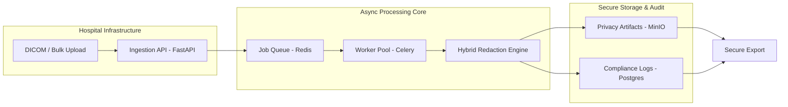

<div align="center">

</div>

# GuardVision: Privacy Intelligence for Everyone


[]()
[]()

**GuardVision** is a next-generation privacy protection system that automatically detects and redacts sensitive personal (PII) and medical (PHI) information from images.

We operate on a **Dual-Mode Architecture** designed to serve both individual users needing quick privacy tools and large healthcare enterprises requiring strict compliance.

---

## 🚀 Two Modes, One Mission

### 1. Individual Mode (Powered by Gemini Flash)
*For researchers, developers, and everyday users.*
- **Instant Privacy**: Drop an image, get a redacted version in seconds.
- **AI-Driven Accuracy**: Uses **Gemini 1.5 Flash** to visually recognize complex PII like faces, signatures, and credit cards without traditional OCR limitations.
- **Zero Setup**: Runs entirely in the browser/client-side with a lightweight API call.

### 2. Enterprise Mode (Hospital-Grade Architecture)
*For hospitals, insurance firms, and regulated industries.*
- **Bulk Processing Pipeline**: A robust backend architecture designed to handle thousands of patient records or DICOM files simultaneously.
- **Deterministic Compliance**: Combines AI with **Microsoft Presidio** and strict rule-based redaction to ensure 0% data leakage transparency.
- **Full Auditability**: Every single redaction is logged, time-stamped, and verifiable for HIPAA/GDPR audits.

---

## 🏗️ Enterprise Architecture

The Enterprise Mode is built on a scalable, asynchronous pipeline designed for high-throughput environments like PACS servers or data lakes.



### Technical Stack (Enterprise)
- **Ingestion**: **FastAPI** for high-performance, async request handling.
- **Queue**: **Redis** to decouple upload from processing, preventing system overloads.
- **Workers**: **Celery** distributed workers for parallel processing of massive datasets.
- **Storage**: **MinIO** (S3-compatible) for secure, on-premise object storage.
- **Database**: **PostgreSQL** for immutable audit trails of every redacted entity.

---

## 🎥 Demo (Individual Mode)

See the real-time AI redaction in action:

[](https://www.youtube.com/watch?v=-PxtRT_xSe4)

---

## 🛠️ Getting Started

### Prerequisites
- Node.js v18+
- Python 3.9+ (for Enterprise backend)
- Redis & PostgreSQL (for local Enterprise testing)

### Quick Start (Individual Mode)
1.  **Clone the repository:**
    ```bash
    git clone https://github.com/SowmyaLR/GuardVision.git
    cd GuardVision
    ```

2.  **Install & Run:**
    ```bash
    npm install
    npm run dev
    ```

3.  **Configure API:**
    Add your Gemini API key to `.env.local`:
    ```env
    GEMINI_API_KEY=your_key_here
    ```

---

## 🗺️ Roadmap: The Path to Zero-Trust
We are actively building out the Enterprise features to move from cloud-dependent AI to fully offline, zero-trust processing.
- [ ] **Phase 1**: Deterministic local processing (removing external LLM dependencies for sensitive data).
- [ ] **Phase 2**: Direct PACS integration for seamless hospital workflows.
- [ ] **Phase 3**: Federated learning support for improving detection models without moving data.

---

## 🤝 Code of Conduct
Please review our [Code of Conduct](CODE_CONDUCT.md) before contributing.

---
<div align="center">
Built for the <b>AI for Bharat</b> Hackathon 🇮🇳
</div>
